# 🧠 AI Newsletter Automation

> Automated AI news aggregation and email delivery system powered by LangChain, LangGraph, and Tavily Search.

## ✨ Features

- **🔍 Smart News Aggregation** - Uses Tavily Search API to fetch the latest AI news, emerging technologies, and industry updates
- **🤖 AI-Powered Curation** - Structures and formats news using Gemini 2.5 Flash
- **📧 Beautiful HTML Emails** - Automatically generates professional newsletter emails with modern design
- **⏰ Scheduled Delivery** - Runs on a configurable schedule (default: every 5 minutes)
- **🎨 Mobile-Friendly Design** - Email templates optimized for all devices

## 🏗️ Architecture

```mermaid
graph LR
    A[🕐 Scheduler<br/>run.py] -->|Every 5 min| B[🔍 Search News<br/>Tavily API]
    B --> C[🤖 AI Agent<br/>Gemini 2.5]
    C --> D[📝 Structure Data<br/>JSON Schema]
    D --> E[✉️ Generate Email<br/>HTML Template]
    E --> F[📤 Send Email<br/>SMTP]

    style A fill:#667eea,stroke:#764ba2,color:#fff
    style B fill:#f093fb,stroke:#f5576c,color:#fff
    style C fill:#4facfe,stroke:#00f2fe,color:#fff
    style D fill:#43e97b,stroke:#38f9d7,color:#fff
    style E fill:#fa709a,stroke:#fee140,color:#fff
    style F fill:#30cfd0,stroke:#330867,color:#fff
```



## 🚀 Quick Start

### Prerequisites

- Python 3.8+
- Gmail account with App Password enabled
- API Keys: Groq/Gemini, Tavily

### Installation

```bash
# Clone the repository
git clone <your-repo-url>
cd email

# Install dependencies
pip install -r requirements.txt

# Configure environment variables
cp .env.example .env
# Edit .env with your API keys and email credentials
```

### Configuration

Create a `.env` file with the following:

```env
GEMINI_API_KEY=your_gemini_api_key
TAVILY_API_KEY=your_tavily_api_key
SENDER_EMAIL=your_email@gmail.com
SENDER_PASSWORD=your_app_password
```

### Usage

**Run once:**

```bash
python main.py
```

**Run on schedule:**

```bash
python run.py
```

## 📁 Project Structure

```
email/
├── main.py          # Core workflow logic with LangGraph
├── run.py           # Scheduler for automated execution
├── .env             # Environment variables (not committed)
└── requirements.txt # Python dependencies
```

## 🛠️ Tech Stack

| Component     | Technology                        |
| ------------- | --------------------------------- |
| **LLM**       | Gemini 2.5 Flash
| **Workflow**  | LangGraph                         |
| **Search**    | Tavily Search API                 |
| **Email**     | Python smtplib (SMTP)             |
| **Scheduler** | Python schedule                   |

## 📧 Email Newsletter Preview

Each newsletter includes:

- 🎯 Catchy subject line
- 📰 Top 10 AI news stories
- 🔗 Direct links to sources
- 🎨 Modern card-based layout
- 📱 Mobile-responsive design

